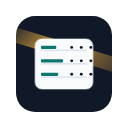
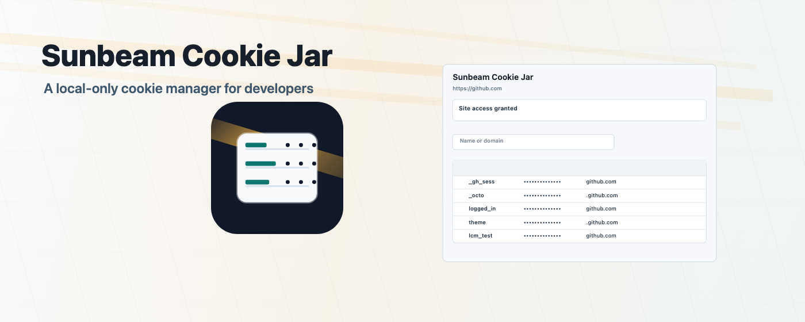
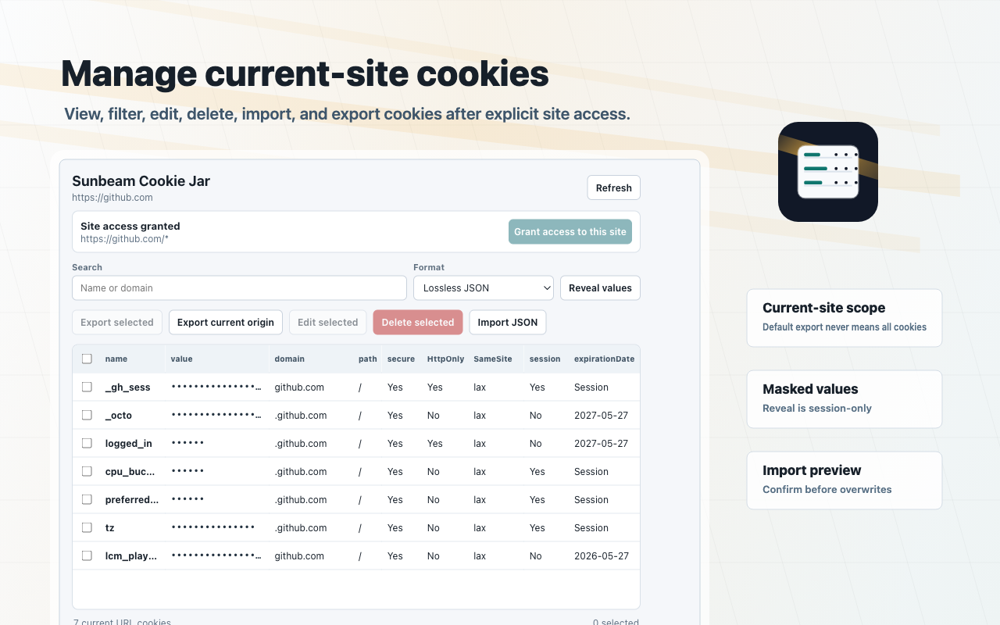
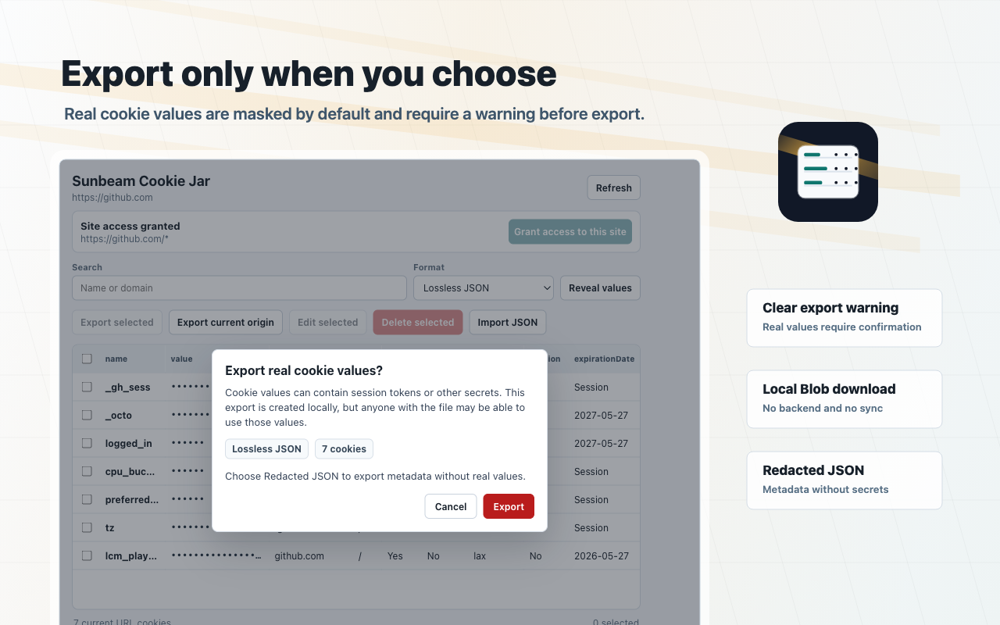
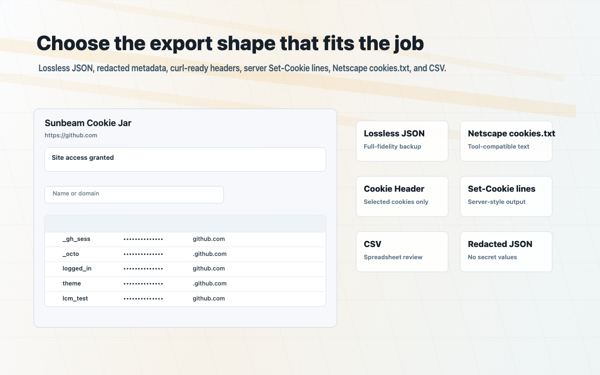
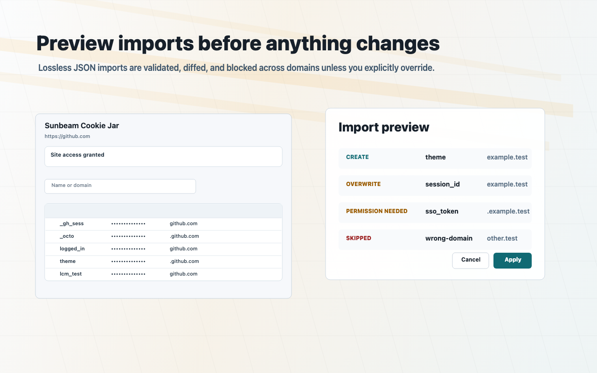
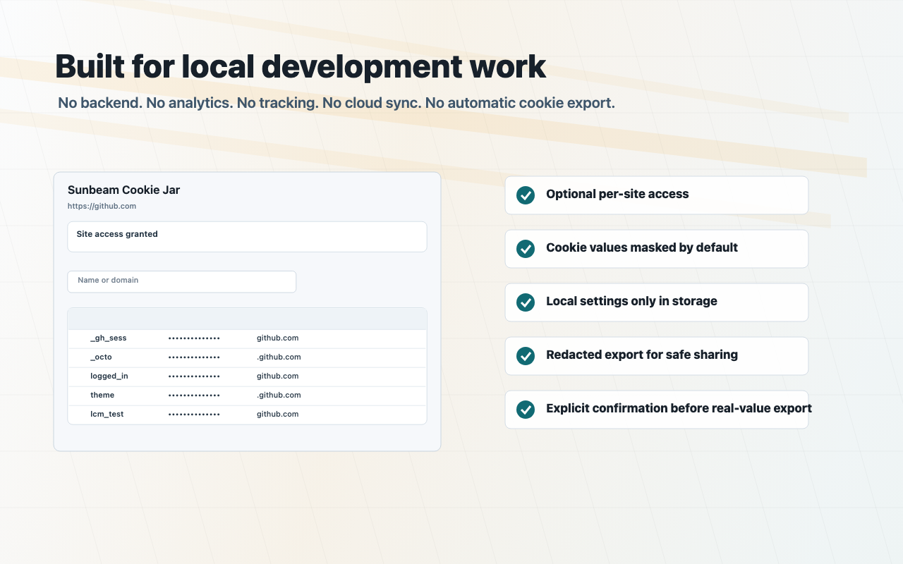

<p align="center">
  
</p>

<h1 align="center">Sunbeam Cookie Jar</h1>

<p align="center">
  A local-only Chrome MV3 cookie manager for developers.
</p>

<p align="center">
  <a href="https://github.com/exordor/sunbeam-cookie-jar/actions/workflows/ci.yml">
    
  </a>
  <a href="https://github.com/exordor/sunbeam-cookie-jar/actions/workflows/pages.yml">
    
  </a>
  
  
</p>

<p align="center">
  <a href="https://exordor.github.io/sunbeam-cookie-jar/">Website</a>
  ·
  <a href="https://exordor.github.io/sunbeam-cookie-jar/privacy.html">Privacy Policy</a>
  ·
  <a href="STORE_SUBMISSION.md">Chrome Web Store Materials</a>
</p>



Sunbeam Cookie Jar is a local-only Chrome Manifest V3 extension for viewing, editing, deleting, importing, and exporting cookies for the current site. It is built for development workflows where cookie values are sensitive and should stay on the local machine.

## Highlights

- View current-site cookies in a compact table.
- Filter cookies by name or domain.
- Mask values by default; reveal is session-only.
- Edit cookies with `chrome.cookies.set`.
- Delete selected cookies.
- Export selected or current-site cookies.
- Import Lossless JSON v1 with a preview diff before applying changes.
- Require explicit confirmation before real-value exports.
- Use optional host permissions instead of required `<all_urls>`.

## Screenshots

| Current-site cookies | Export warning |
| --- | --- |
|  |  |

| Export formats | Import preview |
| --- | --- |
|  |  |



## Export Formats

- Lossless JSON
- Redacted JSON
- Netscape cookies.txt
- Cookie Header
- Set-Cookie lines
- CSV

Lossless JSON preserves cookie fields including `storeId` and `partitionKey` when present.

## Privacy Model

Sunbeam Cookie Jar is intentionally local-only:

- No backend
- No analytics
- No tracking
- No cloud sync
- No remote code
- No automatic background cookie export
- No required `<all_urls>` permission

Host access is optional and requested only for the current site after the popup is opened. `chrome.storage.local` is used only for local UI settings, such as the preferred export format; cookie values are not stored there.

## Permissions

| Permission | Why it is used |
| --- | --- |
| `cookies` | Read, edit, delete, import, and export cookies after site access is granted. |
| `storage` | Store local UI settings only. Cookie values are not persisted. |
| `activeTab` | Identify the active tab and display the current origin. |
| Optional `http://*/*`, `https://*/*` | Request per-site access after the user clicks the grant button. |

## Install Locally

```bash
npm ci
npm run build
```

Then open `chrome://extensions`, enable **Developer Mode**, choose **Load unpacked**, and select `dist/`.

## Development

```bash
npm ci
npm run typecheck
npm test
npm run build
```

Run the GitHub E2E test:

```bash
npm run build
npm run test:e2e:github
```

The Playwright test launches Chromium with the unpacked extension, opens `https://github.com/`, reads GitHub cookies through real Chrome extension APIs, and captures screenshots. In CI, it uses a copied test fixture with GitHub host access pregranted so Chrome's native permission prompt does not require a human click. The production manifest still uses optional host permissions only.

## Chrome Web Store Release

Generate and verify store assets:

```bash
npm run generate:store-assets
npm run verify:store-assets
```

Create the upload zip:

```bash
npm run package:store
```

Submission materials:

- `STORE_SUBMISSION.md`
- `docs/privacy-policy.md`
- `docs/release-checklist.md`
- `store-assets/`

## Website

The public project website is deployed with GitHub Pages:

```text
https://exordor.github.io/sunbeam-cookie-jar/
```

Chrome Web Store privacy policy URL:

```text
https://exordor.github.io/sunbeam-cookie-jar/privacy.html
```
